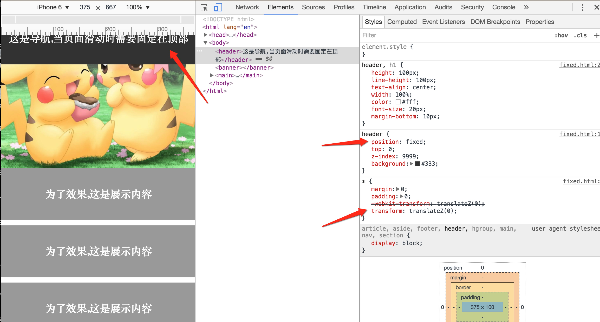
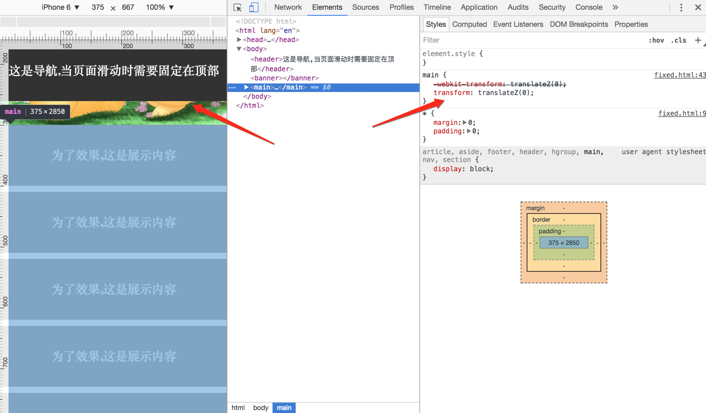

###关于手机硬件加速与position:fixed和监听window滑动事件的坑
昨天做一个特简单的功能掉进了这个坑里.移动端html5需要做一个导航固定在顶部,下面的内容可以无限滑动下拉加载,本来这个功能只需要给导航条一个position:fixed,然后监听window.onscroll就ok了,可是被这段代码给坑了.

```
* {
	-webkit-transform: translateZ(0);
   transform: translateZ(0);
}
```
**全局的硬件加速**

启用这个会使position失效



**so:**
启用硬件加速还不能随便用,给该用的元素用,不该用的元素能别用就别用,因为还不知道啥坑等着!
下面我是给需要滑动的内容启用硬件加速就没问题了.



###还有一种方式可以不用理会*的硬件加速完成上面的部分功能,就是:

```
body {
	overflow: hidden;
}

main {
	overflow-y: scroll;
}

```
**但是这种方法的弊端是无法监听window的滑动事件,如果去监听main的滑动事件,那main的高到底是写100% 还是不设呢;不设高相当于默认继承body的overflow:hidden;  设高值,又怎么去监听main滑动到底部下拉加载数据呢?因为一直都在底部啊!!!**


**上述理解并不十分透彻,仅作个人记载,如有小伙伴更深入,还望指点迷津**


